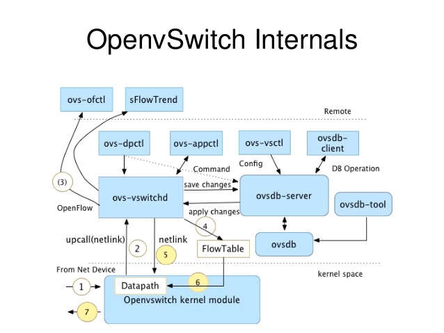
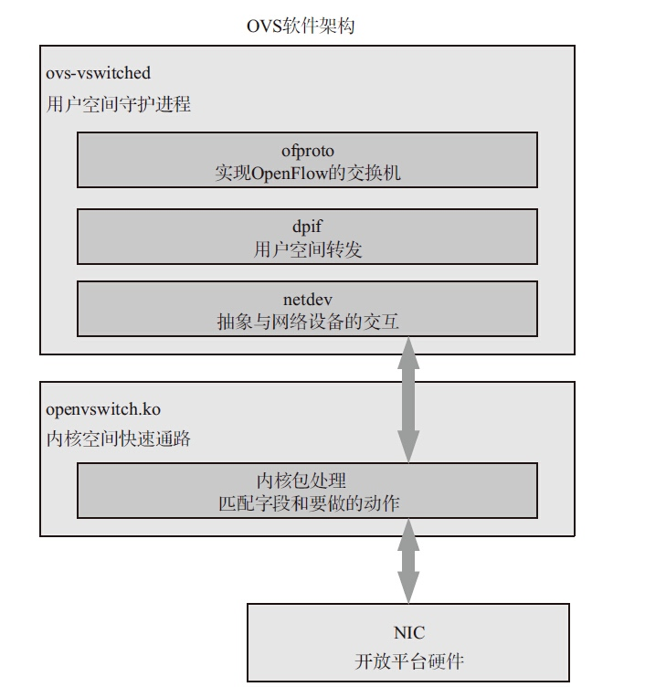
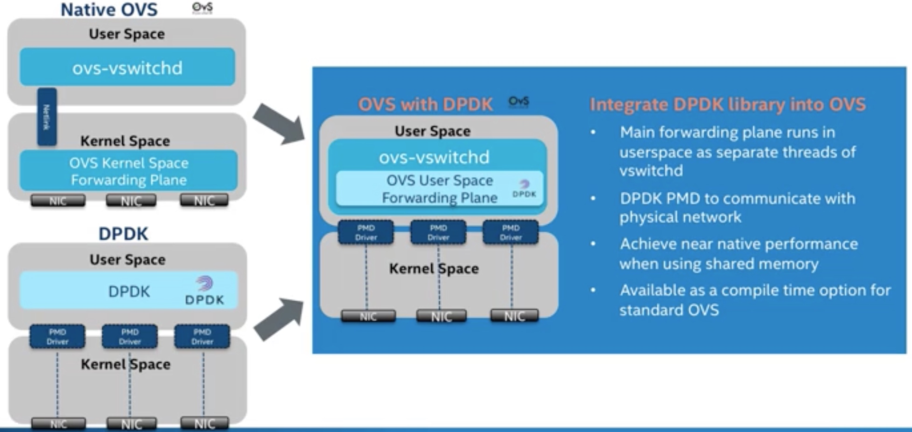
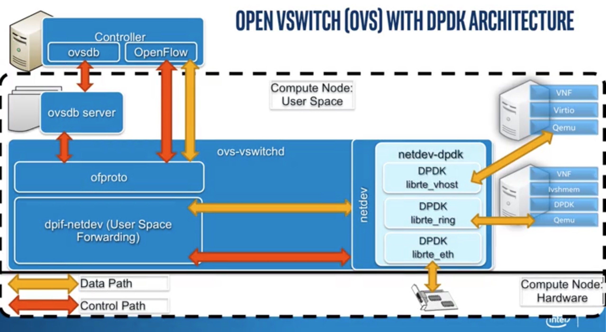
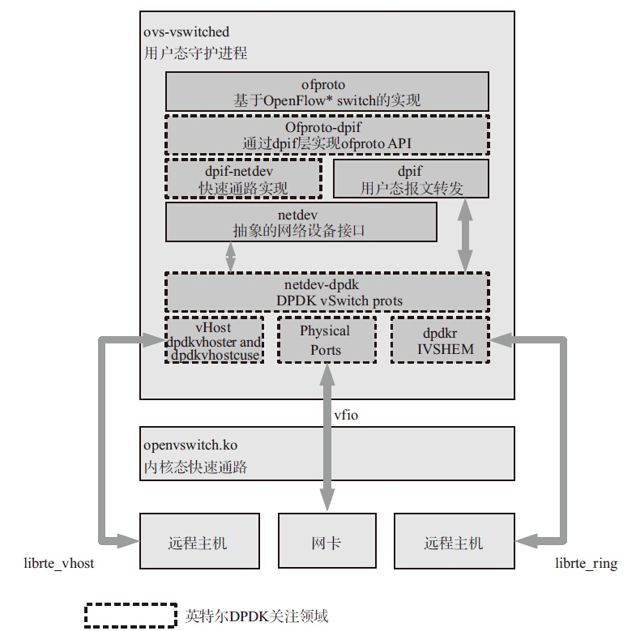
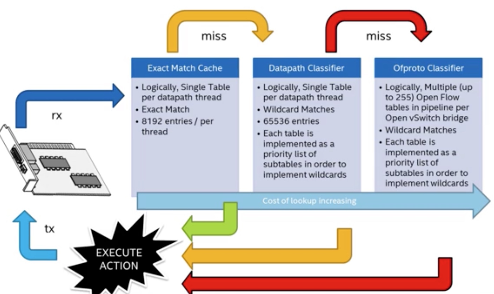
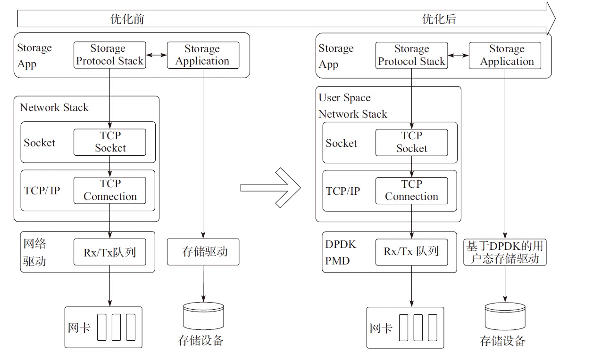

# OVS DPDK

`OVS`在实现中分为用户空间和内核空间两个部分。用户空间拥有多个组件，它们主要负责实现数据交换和OpenFlow流表功能，还有一些工具用于虚拟交换机管理、数据库搭建以及和内核组件的交互。内核组件主要负责流表查找的快速通道。`OVS`的核心组件及其关联关系如图

下图显示了`OVS`数据通路的内部模块图

`DPDK`加速的思想就是专注在这个数据通路上

`ovs-vswitchd`主要包含`ofproto`、`dpif`、`netdev`模块。`ofproto`模块实现`openflow`的交换机；`dpif`模块抽象一个单转发路径；`netdev`模块抽象网络接口（无论物理的还是虚拟的）。
`openvswitch.ko`主要由数据通路模块组成，里面包含着流表。流表中的每个表项由一些匹配字段和要做的动作组成。

## ovs with dpdk

- dpif-netdev：用户态的快速通路，实现了基于netdev设备的dpif API。
- Ofproto-dpif：实现了基于dpif层的ofproto API。
- netdev-dpdk：实现了基于DPDK的netdev API，其定义的几种网络接口如下：
- dpdk物理网口：其实现是采用高性能向量化DPDK PMD的驱动。
- dpdkvhostuser与dpdkvhostcuse接口：支持两种DPDK实现的vhost优化接口：vhost-user和vhost-cuse。vhost-user或vhost-cuse可以挂接到用户态的数据通道上，与虚拟机的virtio网口快速通信。如第12章所说，vhost-cuse是一个过渡性技术，vhost-user是建议使用的接口。为了性能，在vhost burst收发包个数上，需要和dpdk物理网口设置的burst收发包个数相同。
- dpdkr：其实现是基于DPDK librte_ring机制创建的DPDK ring接口。dpdkr接口挂接到用户态的数据通道上，与使用了IVSHMEM的虚拟机合作可以通过零拷贝技术实现高速通信。

DPDK加速的OVS数据流转发的大致流程如下：

1）OVS的ovs-vswitchd接收到从OVS连接的某个网络端口发来的数据包，从数据包中提取源/目的IP、源/目的MAC、端口等信息。
2）OVS在用户态查看精确流表和模糊流表，如果命中，则直接转发。
3）如果还不命中，在SDN控制器接入的情况下，经过OpenFlow协议，通告给控制器，由控制器处理。
4）控制器下发新的流表，该数据包重新发起选路，匹配；报文转发，结束。

DPDK加速的OVS与原始OVS的区别在于，从OVS连接的某个网络端口接收到的报文不需要openvswitch.ko内核态的处理，报文通过DPDK PMD驱动直接到达用户态ovs-vswitchd里。

## Packet Flow

## 网络存储优化

