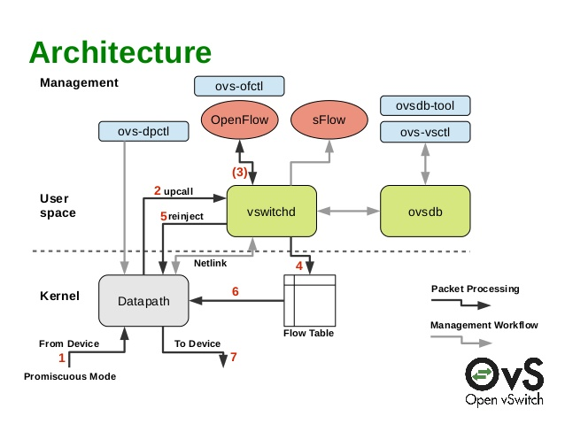
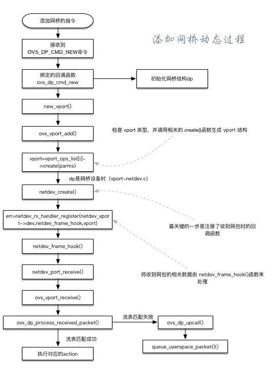
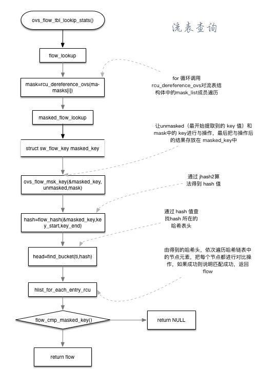
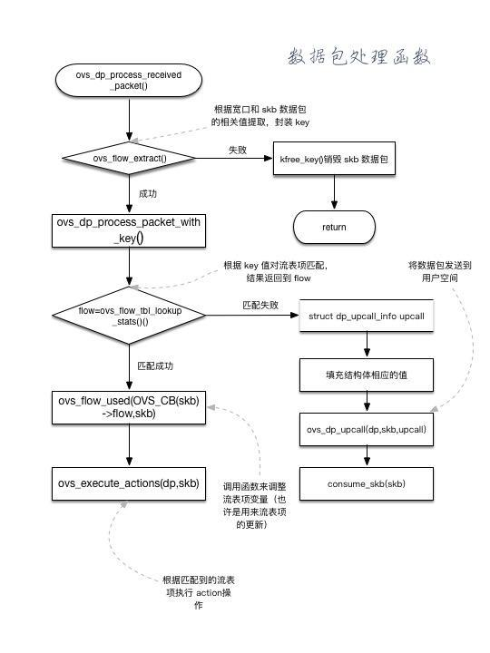
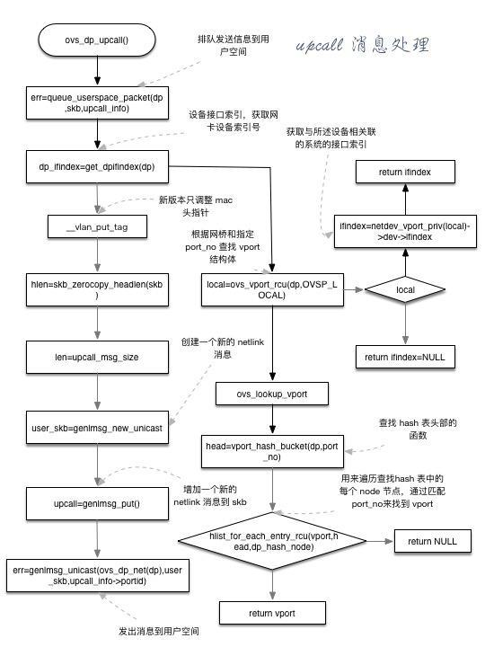

# OVS原理

## OVS架构

> 图片来源[2015 FOSDEM - OVS Stateful Services](https://www.slideshare.net/ThomasGraf5/2015-fosdem-ovs-stateful-services)

`ovs`的架构如上图所示，主要由内核`datapath`和用户空间的`vswitchd`、`ovsdb`组成。

> 图片来源[OpenvSwitch Deep Dive](https://www.slideshare.net/rajdeep/openvswitch-deep-dive)

- `datapath`是负责数据交换的内核模块，其从网口读取数据，并快速匹配Flowtable中的流表项，成功的直接转发，失败的上交`vswitchd`处理。它在初始化和`port binding`的时候注册钩子函数，把端口的报文处理接管到内核模块。
- `vswitchd`是一个守护进程，是ovs的管理和控制服务，通过unix socket将配置信息保存到`ovsdb`，并通过`netlink`和内核模块交互
- `ovsdb`则是`ovs`的数据库，保存了`ovs`配置信息

## 主要数据结构

(图片来自[csdn](http://blog.csdn.net/yuzhihui_no1/article/details/39188373))

## 主要流程

_注：部分转载自[OVS 源码分析整理](http://www.jianshu.com/p/bf112793d658)_

### 添加网桥

1. 键入命令ovs-vsctl add-br testBR
2. 内核中的 openvswitch.ko 收到一个添加网桥的命令时候——即收到 OVS_DATAPATH_FAMILY通道的 OVS_DP_CMD_NEW命令。该命令绑定的回调函数为 ovs_dp_cmd_new
3. ovs_dp_cmd_new 函数除了初始化 dp 结构外，调用 new_vport 函数来生成新的 vport
4. new_vport 函数调用 ovs_vport_add()来尝试生成一个新的 vport
5. ovs_vport_add()函数会检查 vport 类型（通过 vport_ops_list[]数组），并调用相关的 create()函数来生成 vport 结构
6. 当dp是网络设备时（vport_netdev.c），最终由 ovs_vport_add()函数调用的是 netdev_create()【在 vport_ops_list的ovs_netdev_ops 中】
7. netdev_create()函数最关键的一步是注册了收到网包时的回调函数
8. err=netdev_rx_handler_register(netdev_vport->dev,netdev_frame_hook,vport);
9. 操作是将 netdev_vport->dev 收到网包时的相关数据由 netdev_frame_hook()函数来处理，都是些辅助处理，依次调用各处理函数，在 netdev_port_receive()【这里会进行数据包的拷贝，避免损坏】进入 ovs_vport_receive()回到 vport.c，从 ovs_dp_process_receive_packet()回到 datapath.c，进行统一处理
10. 流程：netdev_frame_hook()->netdev_port_receive->ovs_vport_receive->ovs_dp_process_received_packet()
11. net_port_receive()首先检测是否 skb 被共享，若是则得到 packet 的拷贝。
12. net_port_receive()其调用ovs_vport_receive()，检查包的校验和，然后交付给我们的vport通用层来处理。

(图片来自[简书](http://www.jianshu.com/p/bf112793d658))

### 流表匹配

1. flow_lookup()查找对应的流表项
2. for 循环调用 rcu_dereference_ovs 对流表结构体中的 mask_list 成员遍历，找到对应的的 成员
3. flow=masked_flow_lookup()遍历进行下一级 hmap查找，找到为止
4. 进入 包含函数 ovs_flow_mask_key(&masked_key,unmasked,mask)，将最开始提取的 Key 值和 mask 的 key 值进行“与”操作，结果存放在 masked_key 中，用来得到后面的 Hash 值
5. hash=flow_hash(&masked_key,key_start,key_end)key 值的匹配字段只有部分
6. ovs_vport_add()函数会检查 vport 类型（通过 vport_ops_list[]数组），并调用相关的 create()函数来生成 vport 结构
7. 可见，当 dp 时网络设备时（vport_netdev.c），最终由 ovs_vport_add()函数调用的是 netdev_create()【在 vport_ops_list的ovs_netdev_ops 中】
8. netdev_vport->dev 收到网包时的相关数据由 netdev_frame_hook()函数来处理，都是些辅助处理，依次调用各处理函数，在 netdev_port_receive()【这里会进行数据包的拷贝，避免损坏】进入 ovs_vport_receive()回到 vport.c，从 ovs_dp_process_receive_packet()回到 datapath.c，进行统一处理

### 收包处理

1. ovs_vport_receive_packets()调用ovs_flow_extract基于skb生成key值，并检查是否有错,然后调用ovs_dp_process_packet。交付给datapath处理
2. ovs_flow_tbl_lookup_stats。基于前面生成的key值进行流表查找，返回匹配的流表项，结构为sw_flow。
3. 若不存在匹配，则调用ovs_dp_upcall上传至userspace进行匹配。 (包括包和key都要上传)
4. 若存在匹配，则直接调用ovs_execute_actions执行对应的action，比如添加vlan头，转发到某个port等。

### upcall 消息处理

1. ovs_dp_upcall()首先调用 err=queue_userspace_packet()将信息排队发到用户空间去
2. dp_ifindex=get_dpifindex(dp)获取网卡设备索引号
3. 调整 VLAN的 MAC 地址头指针
4. 网络链路属性，如果不需要填充则调用此函数
5. len=upcall_msg_size()，获得 upcall 发送消息的大小
6. user_skb=genlmsg_new_unicast，创建一个新的 netlink 消息
7. upcall=genlmsg_put()增加一个新的 netlink 消息到 skb
8. err=genlmsg_unicast(),发送消息到用户空间去处理

## 参考文档

- [OVS 源码分析整理](http://www.jianshu.com/p/bf112793d658)
- [openvswitch源码分析](http://blog.csdn.net/column/details/openvswitch.html)
- [OVS Deep Dive](http://docs.openvswitch.org/en/latest/topics/)
