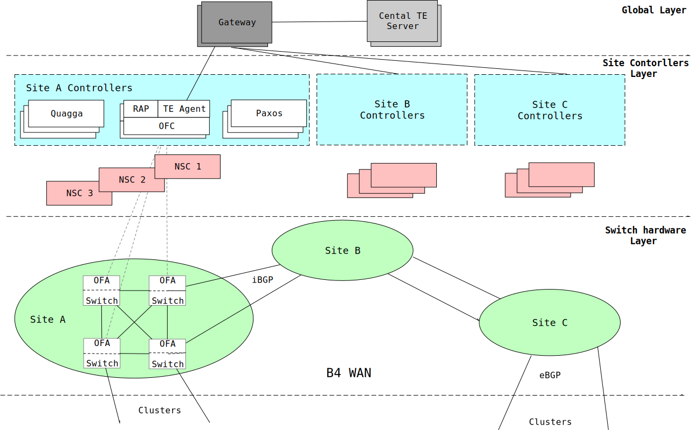
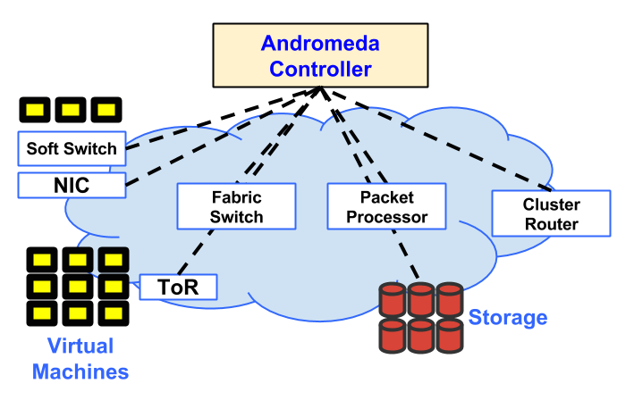
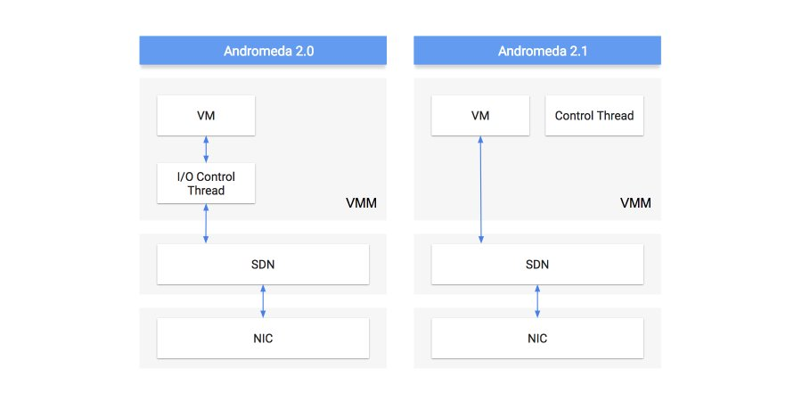

# Google Data Center Networks

## B4

Google B4是第一个成功的`SD-WAN`应用案例，它也是最出名的SDN案例。

B4网络承载了Google数据中心90%的内部应用流量。

B4网络具有流量大、突发性强、周期性强等特定，需要网络具备多路径转发与负载均衡，网络带宽动态调整等能力。

B4面临的问题是网络流量分布的不均匀，高峰期流量达到平时流量的2-3倍，而且不同类型的网络流量的数据量、延时要求和优先级都不同。所以，邀请B4满足弹性带宽获取(Elastic bandwidth demands)、大规模站点(Moderate number of size)、应用端控制(End application control)、低成本(Cost sensitivity)等要求。

B4的SDN架构分为交换机硬件层(switch hardware layer)、站点控制层(site controller layer)和全局控制层(global layer)三大部分。

Google B4采用SDN架构之后，其WAN的链路层利用率从30%~40%提升到90%以上，效果非常显著。

B4是第一个基于SDN架构的WAN网络部署案例，其设计思路、实现方案和真实部署给WAN领域的应用提供了非常重要的参考价值。

## Jupiter

Google通过SDN的途径来构建Jupiter，Jupiter是一个能够支持超过10万台服务器规模的数据中心互联架构。它支持超过1 Pb/s的总带宽来承载其服务。

## Andromeda

Google Andromeda是一个网络功能虚拟化（NFV）堆栈，通过融合软件定义网络(SDN)和网络功能虚拟化(NFV)，Andromeda能够提供分布式拒绝服务(DDoS)攻击保护、透明的服务负载均衡、访问控制列表和防火墙。

[@googlecloud](https://twitter.com/googleclud) tweet [Andromeda 2.1's optimized datapath using hypervisor bypass.](https://twitter.com/googlecloud/status/929091548985413632)

[Andromeda 2.1 reduces GCP’s intra-zone latency by 40%](https://cloudplatform.googleblog.com/2017/11/Andromeda-2-1-reduces-GCPs-intra-zone-latency-by-40-percent.html)

## Espresso

Espresso将SDN扩展到Google网络的对等边缘，连接到全球其他网络。Espresso使得Google根据网络连接实时性的测量动态智能化地为个人用户提供服务。

> “根据其IP地址（或DNS解析器的IP地址），我们动态选择最佳网络接入点，并根据实际的性能数据重新平衡流量，而不是选择一个静态点。”

Expresso在与标签交换结构相同的服务器上运行边界网关协议（BGP）。分组处理器将标签插入每个数据包。路由器读取标签后，每个城市的本地控制器都可以编写标签交换结构。服务器向全局控制器发送流量实时的情况简报。通过这种途径，本地控制器可以实时更新，全球控制器可以集成所有区域。

**参考链接**

- <https://cloudplatform.googleblog.com/2015/06/A-Look-Inside-Googles-Data-Center-Networks.html>
- <https://cloudplatform.googleblog.com/2014/04/enter-andromeda-zone-google-cloud-platforms-latest-networking-stack.html>
- <https://blog.google/topics/google-cloud/making-google-cloud-faster-more-available-and-cost-effective-extending-sdn-public-internet-espresso/>
- <https://people.eecs.berkeley.edu/~sylvia/cs268-2014/papers/b4-sigcomm13.pdf>
