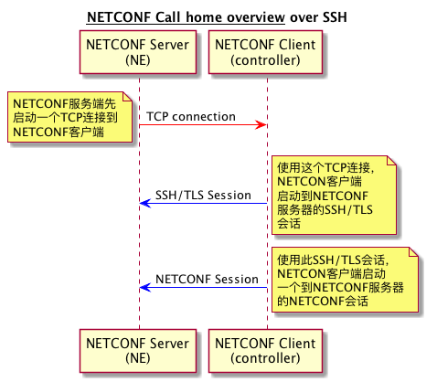

# NETCONF Call Home


本文主要内容都来自于今年二月发布的[RFC8071 - NETCONF Call Home and RESTCONF Call Home](https://tools.ietf.org/html/rfc8071)，该RFC从2015年4月提出到最终发布一共修改了17个版本，其间修改内容可以[点击查看详细内容](https://datatracker.ietf.org/doc/rfc8071/)。

## 介绍

`NETCONF Call Home`支持两种安全传输网络配置协议分别是`Secure Shell(SSH)`和传输层安全`(TLS)`。  
> `NETCONF`协议​​的绑定到`SSH`在[RFC6242](https://tools.ietf.org/html/rfc6242)中定义。
> `NETCONF`协议​​的绑定到`TLS`在[RFC7589](https://tools.ietf.org/html/rfc7589)中定义。
> `SSH`协议在[RFC4253](https://tools.ietf.org/html/rfc4253)中定义，`TLS`协议是在[RFC5246](https://tools.ietf.org/html/rfc4253)中定义。`SSH`和`TLS`协议都是`TCP`协议之上的协议。

### 动机

`call home`对于网络设备的初始化部署和持续管理都是非常有帮助的。那网络设备为什么使用`call home`这种方式？

 - 网络设备在第一次启动后可以主动`call home`，以便在其管理系统上注册。

- 网络设备可以以一种动态分配`IP`地址的方式访问网络，但是不会将其分配的IP地址注册到映射服务(例如，动态`DNS`)。

- 网络设备可以部署在实现所有内部网络IP地址的网络地址转换（NAT）的防火墙后面。

- 网络设备元件可以部署在不允许任何管理访问内部网络的防火墙之后。

- 网络设备可以配置为“隐身模式”，因此没有任何的端口可以提供给管理系统打开连接。

- 运营商可能倾向于让网络设备发起管理连接，认为在数据中心中保护一个开放端口比在网络中的每个网络设备上具有开放端口更容易。

### 解决方案概述

下图说明了协议分层的`call home`



> 消息层流程PlantUML请查看[netconf-messages-layer-flow.puml](https://raw.githubusercontent.com/tonydeng/sdn-handbook/master/puml/netconf-call-home.puml)

这张图有以下几点：

 1. `NETCONF`服务器首先启动一个`TCP`连接到`NETCONF`客户端。
 2. 使用这个`TCP`连接，`NETCONF`客户端启动到`NETCONF`服务器的`SSH/TLS`会话。
 3. 使用此`SSH/TLS`会话，`NETCONF`客户端启动一个到`NETCONF`服务器的`NETCONF`会话。

## NETCONF客户端

术语“客户端”在[RFC6241第1.1节](https://tools.ietf.org/html/rfc6241#section-1.1)中定义。 在网络管理的情况下，`NETCONF`客户端可能是一个网络管理系统。

### 客户端协议操作事项

- C1 `NETCONF`客户端侦听来自`NETCONF`服务器的`TCP`连接请求。 客户端必须支持在[第6节](https://tools.ietf.org/html/rfc8071#section-6)中定义的`IANA`分配的端口上接受`TCP`连接，但可以配置为侦听不同的端口。
- C2 `NETCONF`客户端接受传入的`TCP`连接请求，并建立`TCP`连接。
- C3 使用此`TCP`连接，`NETCONF`客户端启动`SSH`客户端[RFC4253](https://tools.ietf.org/html/rfc4253)或`TLS`客户端[RFC5246](https://tools.ietf.org/html/rfc5246)协议。 例如，假定使用`IANA分`配的端口，则在端口`4334`接受连接时启动`SSH`客户端协议，并且在端口`4335`或端口`4336`上接受连接时启动`TLS`客户端协议。
- C4 当使用`TLS`时，`NETCONF`客户端必须告知`"peer_allowed_to_send"`，如[RFC6520](https://tools.ietf.org/html/rfc6520)所定义。 这是必需的，以便`NETCONF`服务器知道在`call home`连接时需要发送心跳包，保持长连接。
- C5 作为建立`SSH`或`TLS`连接的一部分，`NETCONF`客户端必须验证服务器提供的主机密钥或证书。 该验证可以通过证书路径验证或通过将主机密钥或证书与先前信任的或“固定的”值进行比较来完成。 如果证书被提交并且包含撤销检查信息，`NETCONF`客户端应该检查证书的撤销状态。 如果确定证书已被吊销，客户端必须马上关闭连接。
- C6 如果使用证书路径验证，则`NETCONF`客户端必须确保提供的证书具有对预先配置的颁发者证书的有效信任链，并且所呈现的证书对客户端之前知道的“标识符”[RFC6125](https://tools.ietf.org/html/rfc6125)进行编码 连接尝试。 如何在证书中编码标识符可以由与证书颁发者相关的策略来确定。 例如，可以知道给定的颁发者只在`X.509`证书的`“CommonName”`字段中签署具有唯一标识符（例如，序列号）的`IDevID`证书[Std-802.1AR-2009](https://tools.ietf.org/html/rfc8071#ref-Std-802.1AR-2009)。
- C7 服务器的主机密钥或证书经过验证后，客户端将以`SSH`或`TLS`协议进行建立`SSH`或`TLS`连接。 在使用`NETCONF` 服务器执行客户端认证时，`NETCONF`客户端必须仅使用先前为`NETCONF`服务器提供的主机密钥或服务器证书关联的凭证。
- C8 一旦`SSH`或`TLS`连接建立，`NETCONF`客户端启动`NETCONF`客户端[RFC6241](https://tools.ietf.org/html/rfc6241)或`RESTCONF`客户端[RFC8040](https://tools.ietf.org/html/rfc8040)协议。 假设使用`IANA`分配的端口，当在端口`4334`或端口`4335`上接受连接时启动`NETCONF`客户端协议，并且当在端口`4336`上接受连接时启动`RESTCONF`客户端协议。


### 客户端配置数据模型

如何配置`NETCONF`或`RESTCONF`客户端超出了本文的范围。

例如，可以使用什么样的配置来启用对`call home`的监听，配置可信证书颁发者，或者为预期的连接配置标识符。 也就是说，在[NETCONF-MODELS](https://tools.ietf.org/html/rfc8071#ref-NETCONF-MODELS)和[RESTCONF-MODELS](https://tools.ietf.org/html/rfc8071#ref-RESTCONF-MODELS)中提供了用于配置`NETCONF`和`RESTCONF`客户端的`YANG` [RFC7950](https://tools.ietf.org/html/rfc7950)数据模块，包括`call home`。

## NETCONF服务器

术语“服务器”在[RFC6241第1.1节](https://tools.ietf.org/html/rfc6241#section-1.1)中定义。 在网络管理的情况下，`NETCONF`服务器可能是网络元件或设备。

### 服务器协议操作

- S1 `NETCONF`服务器向`NETCONF`客户端发起`TCP`连接请求。 源端口可以根据本地策略或由操作系统随机分配。 服务器必须支持连接到[第6节](https://tools.ietf.org/html/rfc8071#section-6)中定义的一个`IANA`分配的端口，但可以配置为连接到不同的端口。 使用`IANA`分配的端口，服务器通过`SSH`连接到`NETCONF`的端口`4334`，通过`TLS`连接到`NETCONF`的端口`4335`和通过`TLS`的`RESTCONF`的端口`4336`。
- S2 `TCP`连接请求被接受，`TCP`连接被建立。
- S3 使用此`TCP`连接，`NETCONF`服务器将启动`SSH`服务器[RFC4253](https://tools.ietf.org/html/rfc4253)或`TLS`服务器[RFC5246](https://tools.ietf.org/html/rfc5246)协议，具体取决于它如何配置。 例如，假定使用`IANA`分配的端口，则在连接到远程端口`4334`之后使用`SSH`服务器协议，并且在连接到远程端口`4335`或远程端口`4336`之后使用`TLS`服务器协议。
- S4 作为建立`SSH`或`TLS`连接的一部分，`NETCONF`服务器会将其主机密钥或证书发送给客户端。 如果发送了一个证书，服务器还必须发送所有中间证书到一个知名和可信赖的发行者。 如何发送证书列表在[RFC6187第2.1节](https://tools.ietf.org/html/rfc6187#section-2.1)中为`SSH`定义，在[RFC5246第7.4.2节](https://tools.ietf.org/html/rfc5246#section-7.4.2)中为`TLS`定义。
- S5 建立`SSH`或`TLS`会话需要在所有情况下对客户端证书进行服务器身份验证，但`RESTCONF`除外，其中一些客户端身份验证方案在`安全传输连接（TLS）`建立后发生。 如果需要传输级（`SSH`或`TLS`）客户端身份验证，并且客户端无法在本地策略定义的时间内成功向服务器进行身份验证，则服务器必须关闭连接。
- S6 一旦建立了`SSH`或`TLS`连接，`NETCONF`/`RESTCONF`服务器将启动`NETCONF`服务器[RFC6241](https://tools.ietf.org/html/rfc6241)或`RESTCONF`服务器[RFC8040](https://tools.ietf.org/html/rfc8040)协议，具体取决于如何配置。 假设使用`IANA`分配的端口，则在连接到远程端口`4334`或远程端口`4335`之后使用`NETCONF`服务器协议，并且在连接到远程端口`4336`之后使用`RESTCONF`服务器协议。
- S7 如果需要长连接，作为连接发起者的`NETCONF`/`RESTCONF`服务器应该使用`keep-alive`机制主动测试连接的活跃性。 对于基于`TLS`的连接，`NETCONF`/`RESTCONF`服务器应该发送[RFC6520](https://tools.ietf.org/html/rfc6520)定义的`HeartbeatRequest`消息。 对于基于`SSH`的连接，根据[RFC4254的第4节](https://tools.ietf.org/html/rfc4254#section-4)，服务器应该发送一个`SSH_MSG_GLOBAL_REQUEST`消息，其中包含一个特别不存在的`"request name"`值（例如keepalive@ietf.org）和`"want reply"`值设置为`"1"`。

### 服务器配置数据模型

如何配置`NETCONF`或`RESTCONF`服务器超出了本文的范围。

这包括可能用于指定主机名，`IP`地址，端口，算法或其他相关参数的配置。 也就是说，[NETCONF-MODELS](https://tools.ietf.org/html/rfc8071#ref-NETCONF-MODELS)和[RESTCONF-MODELS](https://tools.ietf.org/html/rfc8071#ref-RESTCONF-MODELS)中提供了用于配置NETCONF和RESTCONF服务器的YANG [RFC7950](https://tools.ietf.org/html/rfc7950)数据模块，包括`call home`。

## 安全考虑

[RFC6242](https://tools.ietf.org/html/rfc6242)和[RFC7589](https://tools.ietf.org/html/rfc7589)以及扩展[RFC4253](https://tools.ietf.org/html/rfc4253)，[RFC5246 ](https://tools.ietf.org/html/rfc5246)和[RFC8040](https://tools.ietf.org/html/rfc8040)中描述的安全考虑也适用于此处。

这个`RFC`与`SSH`/`TLS`服务器启动底层TCP连接的方式背离了标准的`SSH`和`TLS`的使用。 这种逆转与[RFC4253](https://tools.ietf.org/html/rfc4253)中的“客户端启动连接”和[RFC6125](https://tools.ietf.org/html/rfc6125)不一致，它们表示**“客户端必须构建可接受的引用标识符列表，并且必须独立于服务提供的标识符“** 。

与这些差异有关的风险主要集中在服务器认证上，客户无法将独立构建的引用标识符与服务器提供的引用标识符进行比较。为了减轻这些风险，要求`NETCONF`/`RESTCONF`客户端验证服务器的`SSH`主机密钥或证书，通过对预先配置的发行者证书进行证书路径验证，或者通过将主机密钥或证书与先前信任或“固定”值。此外，当使用证书时，要求客户端能够将在提供的证书中编码的标识符与客户端预先配置的标识符（例如，序列号）相匹配。

对于`NETCONF`/`RESTCONF`服务器提供`X.509`证书的情况，`NETCONF`/`RESTCONF`客户端应确保用于证书路径验证的`"\"`预配置颁发者证书对于服务器的制造商是唯一的。也就是说，证书不应该属于可能为多个制造商颁发证书的第三方认证机构。当使用将共享秘密（例如，密码）传递给服务器的客户机认证机制时，这是特别重要的。否则可能会导致客户端将共享密钥发送到恰好与客户端配置期望的服务器具有相同身份（例如，序列号）的另一个服务器的情况。

接下来会考虑与服务器身份验证无关的问题。

运行`NETCONF Call Home`或`RESTCONF Call Home`的面向`Internet`的主机将通过诸如"[zmap](https://tools.ietf.org/html/rfc8071#ref-zmap)"之类的扫描工具进行指纹识别。 `SSH`和`TLS`都提供了许多方法可以在主机上进行指纹识别。 `SSH`和`TLS`服务器相当成熟，能够抵御攻击，但是`SSH`和`TLS`客户端可能不够强大。实施者和部署需要确保提供软件更新机制，以便及时修复漏洞。

攻击者可以在推断出攻击者没有拥有有效密钥之前，对`NETCONF`/`RESTCONF`客户端进行拒绝服务（`DoS`）攻击，执行计算量大的操作。 例如，在[TLS1.3]()中，`ClientHello`消息包含成本很高的非对称密钥操作的密钥共享值。 推荐使用常见的减轻`DoS`攻击的预防措施，例如在一系列不成功的登录尝试后暂时将源地址列入黑名单。

当使用带有`RESTCONF`协议的`call home`时，在使用一些`HTTP`认证方案时，特别要注意传送共享密钥（例如密码）的`Basic` [RFC7617](https://tools.ietf.org/html/rfc7617)和`Digest` [RFC7616](https://tools.ietf.org/html/rfc7616)方案。 对于使用的任何`HTTP`客户机认证方案，实施者和部署都应确保查看`RFC`中的“安全注意事项”部分。

## IANA考虑事项

IANA已经在“用户端口”范围内为服务名称“`netconf-ch-ssh`”，“`netconf-ch-tls`”和“`restconf-ch-tls`”分配了三个`TCP`端口号。 这些端口将是`NETCONF Call Home`和`RESTCONF Call Home`协议的默认端口。 以下是遵循[RFC6335](https://tools.ietf.org/html/rfc6335)中的规则的注册模板。

```txt
Service Name:           netconf-ch-ssh
Port Number:            4334
Transport Protocol(s):  TCP
Description:            NETCONF Call Home (SSH)
Assignee:               IESG <iesg@ietf.org>
Contact:                IETF Chair <chair@ietf.org>
Reference:              RFC 8071

Service Name:           netconf-ch-tls
Port Number:            4335
Transport Protocol(s):  TCP
Description:            NETCONF Call Home (TLS)
Assignee:               IESG <iesg@ietf.org>
Contact:                IETF Chair <chair@ietf.org>
Reference:              RFC 8071

Service Name:           restconf-ch-tls
Port Number:            4336
Transport Protocol(s):  TCP
Description:            RESTCONF Call Home (TLS)
Assignee:               IESG <iesg@ietf.org>
Contact:                IETF Chair <chair@ietf.org>
Reference:              RFC 8071
```

## 参考

- [RFC 8071 - NETCONF Call Home and RESTCONF Call Home](https://tools.ietf.org/html/rfc8071)
- [RFC6242 - Using the NETCONF Protocol over Secure Shell (SSH)](https://tools.ietf.org/html/rfc6242)
- [RFC7589 - Using the NETCONF Protocol over Transport Layer Security (TLS) with Mutual X.509 Authentication](https://tools.ietf.org/html/rfc7589)
- [RFC4253 -  The Secure Shell (SSH) Transport Layer Protocol](https://tools.ietf.org/html/rfc4253)
- [RFC5246 -  The Transport Layer Security (TLS) Protocol Version 1.2](https://tools.ietf.org/html/rfc5246)
- [RFC8040 - RESTCONF Protocol](https://tools.ietf.org/html/rfc8040)
