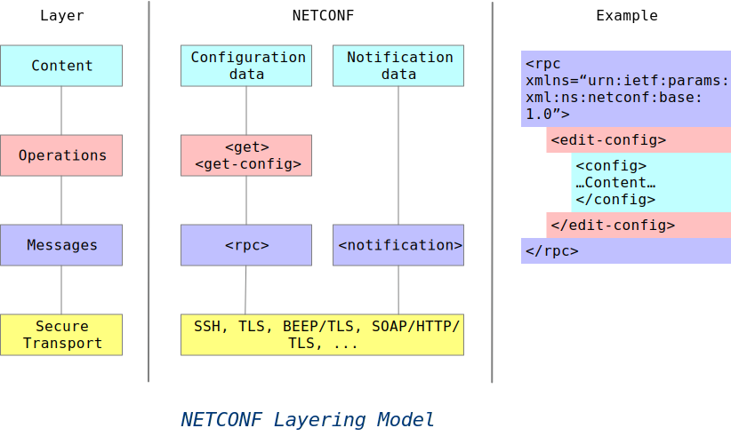
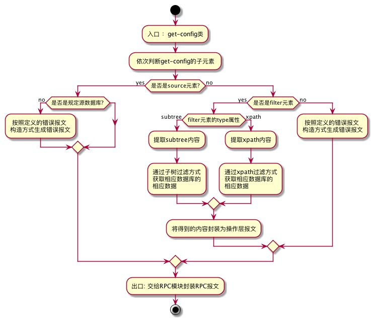

# NETCONF

NETCONF是一个基于XML的交换机配置接口，用于替代CLI、SNMP等配置交换机。

> 本质上来说,NETCONF就是利用XML-RPC的通讯机制实现配置客户端和配置服务端之间的通信，实现对网络设备的配置和管理。

## 协议

NETCONF通过RPC与交换机通信，其协议包含四层

```
            Layer                 Example
       +-------------+      +-----------------+      +----------------+
   (4) |   Content   |      |  Configuration  |      |  Notification  |
       |             |      |      data       |      |      data      |
       +-------------+      +-----------------+      +----------------+
              |                       |                      |
       +-------------+      +-----------------+              |
   (3) | Operations  |      |  <edit-config>  |              |
       |             |      |                 |              |
       +-------------+      +-----------------+              |
              |                       |                      |
       +-------------+      +-----------------+      +----------------+
   (2) |  Messages   |      |     <rpc>,      |      | <notification> |
       |             |      |   <rpc-reply>   |      |                |
       +-------------+      +-----------------+      +----------------+
              |                       |                      |
       +-------------+      +-----------------------------------------+
   (1) |   Secure    |      |  SSH, TLS, BEEP/TLS, SOAP/HTTP/TLS, ... |
       |  Transport  |      |                                         |
       +-------------+      +-----------------------------------------+
```

- (1) 安全传输层，用于跟交换机安全通信，NETCONF并未规定具体使用哪种传输层协议，所以可以使用SSH、TLS、HTTP等各种协议
- (2) 消息层，提供一种传输无关的消息封装格式，用于RPC通信
- (3) 操作层，定义了一系列的RPC调用方法，并可以通过Capabilities来扩展
- (4) 内容层，定义RPC调用的数据内容

### NETCONF Layering Model And Example



## NETCONF技术规范

### 安全传输层

可以使用多种传输协议来进行数据传输，官方默认使用`SSH`进行加密及数据传输。

### 消息层


> 消息层流程PlantUML请查看[netconf-messages-layer-flow.puml](https://raw.githubusercontent.com/tonydeng/sdn-handbook/master/puml/netconf-messages-layer-flow.puml)

上面的流程图看起来比较多，其实总结起来也主要是六步

1. 通过传输协议层模块得到`NETCONF`的请求报文后，就应交由`RPC`模块处理如果`NETCONF`报文经过了压缩或加密的话，先进行解压和解密
1. 然后将`RPC`请求报文，用`RFC4741`的`XML Schema`文件进行验证
1. 如果符合`NETCONF`的报文格式则解析文档中的`RPC`元素部分，进行`RPC`元素中`message—id`和命名空间属性的检查和保存
1. 然后将内部的操作层元素取出传给操作层模块
1. 如果操作层模块处理成功，返回正确的报文
1. RPC模块再将返回的响应报文进行`RPC`层的封装，然后发送给对应的客户端。如果中途在某个环节检查错误或操作层模块错误，则统一封装成错误处理报文，发送给客户端

### 操作层

NETCONF提供了[九种基本操作](https://tools.ietf.org/html/rfc6241#section-7)：

1. [get-config](https://tools.ietf.org/html/rfc6241#section-7.1)
2. [edit-config](https://tools.ietf.org/html/rfc6241#section-7.2)
3. [copy-config](https://tools.ietf.org/html/rfc6241#section-7.3)
4. [delete-config](https://tools.ietf.org/html/rfc6241#section-7.4)
6. [lock](https://tools.ietf.org/html/rfc6241#section-7.5)
7. [unlock](https://tools.ietf.org/html/rfc6241#section-7.6)
5. [get](https://tools.ietf.org/html/rfc6241#section-7.7)
8. [close-session](https://tools.ietf.org/html/rfc6241#section-7.8)
9. [kill-session](https://tools.ietf.org/html/rfc6241#section-7.9)

> 这些操作的参数都各不相同，因此每种操作都有自己的处理流程

以`get-config`为例，我们来看看`get-config`请求报文的解析流程:



> get-config请求报文解析流程PlantUML请查看[netconf-get-config-flow.puml](https://raw.githubusercontent.com/tonydeng/sdn-handbook/master/puml/netconf-get-config-flow.puml)

### 内容层

内容层即配置数据库


## NETCONF实现流程


> NETCONF实现流程PlantUML请查看[netconf-implementation-process.puml](https://raw.githubusercontent.com/tonydeng/sdn-handbook/master/puml/netconf-implementation-process.puml)
>
## NETCONF实现的关键技术

关键的环节包括：**安全认证**、**建立加密传输通道**、**rpc-xml消息收发**、**rpc-xml文件解析**、**rpc-reply消息** 的生成。

### 安全认证实现

使用`ssh`密钥认证方法，在`Client`端生成一对密钥，将公钥传给`Server`相关目录进行备份，借助`libssh2`函数库的相关函数完成安全认证。


### 加密通道建立

借助`SSHv2`本地端口转发功能分别在`Client`端和`Server`端建立一个`SSH隧道`，实现`Client`端`12500端口`和`Server` `830端口`的数据经过`SSH`传输。

命令：`ssh -2 –N–C –f –L 12500:172.16.15.213:830` （Client端执行）
命令：`ssh -2 –N–C –f –L 830:172.16.15.213:12500` （Server端执行）


### xml-rpc消息收发

`Client`端需要将`rpc-xml`文件转换为内容为`rpc`请求的`xml`化的字符，`send()`到`Server`，`Server`端在`recv()`收到字符之后利用`libxml2`库函数生成`rpc-xml`文件的指针，借助`xpath`搜索原理进行相关数据定位，如果检索到相关操作关键字再调用相关函数生成`rpc-reply`文件并转换为字符格式`send()`到`Client`。

### xml消息的解析

`NETCONF`中有9种操作每一种操作的元素各不一样，因此要建立很多个流程来处理每一个操作，对`rpc-xml`请求的合法性以及想要获得的数据等进行定位，这个是`RPC`层需要实现的核心内容。

### xml消息的生成

原则上需要调用配置数据库的相关数据，执行并返回`rpc-xml`请求的结果。

## 参考文档

1. [RFC6241](https://tools.ietf.org/html/rfc6241)
1. [基于NETCONF协议的网管系统Agent端设计和实](http://doc.mbalib.com/view/e2d0c5b3faf4a205059ba5bc9704020d.html)
