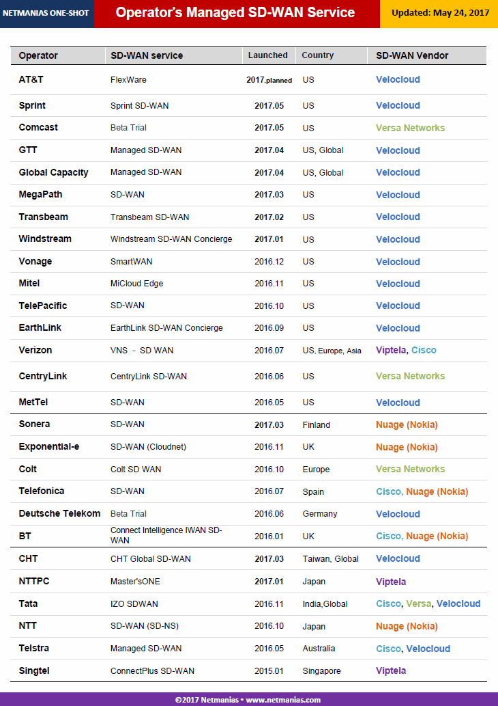

# SD-WAN

SD-WAN (Software-Defined Wide-Area Networking) 是继SDN之后的又一个热门技术，将软件可编程与商业化硬件结合，通过集中管理和软件可编程方式自动部署和管理广域网，加速服务交付，并通过路径优化提升网络性能和可靠性。

SD-WAN服务是基于企业客户的需求，以革新方式亦或是升级方式支持的广域组网SDN解决方案。SDN支持的软件定义广域网络，不仅仅是硬件设备开放的南向接口和Openflow、NETCONF、PCEP等接口协议，也不仅仅是集中的SDN控制器加上业务编排系统，其核心的特点是对应用需求的感知和按需服务，以及以应用视角贯穿的网络构建、用户服务、持续交付、运维支撑、运营保障的全生命周期管理。

目前，全球各大运营商和设备制造商均在积极布局SD-WAN。

## SD-WAN特性

现在普遍认为，SD-WAN应该具有以下4个功能：

- 支持多种连接方式，MPLS，frame relay，LTE，Public Internet等等。SD-WAN将Virtual WAN与传统WAN结合，在这之上做overlay。对于应用程序来说，不需要清楚底层的WAN连接究竟是什么。在不需要传统WAN的场景下，SD-WAN就是Virtual WAN。
- 能够在多种连接之间动态选择链路，以达到负载均衡或者资源弹性。与Virtual WAN类似，动态选择多条路径。SD-WAN如果同时连接了MPLS和Internet，那么可以将一些重要的应用流量，例如VoIP，分流到MPLS，以保证应用的可用性。对于一些对带宽或者稳定性不太敏感的应用流量，例如文件传输，可以分流到Internet上。这样减轻了企业对MPLS的依赖。或者，Internet可以作为MPLS的备份连接，当MPLS出故障了，至少企业的WAN网络不至于也断连。
- 简单的WAN管理接口。凡是涉及网络的事物，似乎都存在管理和故障排查较为复杂的问题，WAN也不例外。SD-WAN通常也会提供一个集中的控制器，来管理WAN连接，设置应用流量policy和优先级，监测WAN连接可用性等等。基于集中控制器，可以再提供CLI或者GUI。以达到简化WAN管理和故障排查的目的。
- 支持VPN，防火墙，网关，WAN优化器等服务。SD-WAN在WAN连接的基础上，将提供尽可能多的，开放的和基于软件的技术。

除此之外，SD-WAN通常还具备以下功能

- 弹性，实时检测网络故障并自动切换链路
- QoS，自动链路选择，为关键应用优化最佳路径
- 安全
- 易部署，易管理，易调试
- 在线流量工程

在部署时，SD-WAN与WAN edge router放置在一起，用来增强WAN edge router甚至替代WAN edge router。

## 相关技术

### Hybrid WAN

Hybrid WAN是指采用同时采用多种WAN连接，通常就是私有MPLS连接和Internet连接。企业通过Hybrid WAN技术，可以将一些应用流量分流到Internet连接上来。毕竟，私有MPLS连接成本不低。从这点看，Hybrid WAN与前面描述的SD-WAN非常接近。实际InfoVista将hybrid WAN看作是SD-WAN的前身。不过Hybrid WAN只是强调同时使用多条WAN连接，SD-WAN在这之上加上了software-defined的概念，这包括了集中控制，智能分析和动态创建网络服务等。Hybrid WAN仍然占据了WAN市场较大一部分，当用户需要升级或者需要更灵活的WAN连接管理时，SD-WAN会是一个不错的替代。

### WAN Optimization

WAN Optimization是指提高数据在WAN上传输效率的技术的集合。SD-WAN关注的是使用低成本线路，以达到高性能线路传输效果。而WAN Optimization关注的是网络数据包如何更有效的在已有线路上传输。在实际中，SD-WAN可以配合WAN Optimization使用。在SD-WAN场景下，WAN Optimization通常是以虚拟的形式存在。

### WAN edge router

前面说过，SD-WAN实际上能增强WAN edge router甚至取而代之。传统的网络厂商一般是在自己的WAN edge device（路由器，NGFW）里集成SD-WAN功能，而新兴的SD-WAN创业公司，更倾向于专有的SD-WAN设备，或者虚拟的SD-WAN产品，来配合WAN edge router。

### MPLS

SD-WAN的倡导者通常会宣称SD-WAN是用来替代MPLS的。不过，只要对网络流量可靠的QoS还有需要，那么MPLS或者其他的传统WAN连接技术仍然是不能替代。现实中，SD-WAN厂商通常会建议MPLS和Virtual WAN一起部署。对于高优先级流量，仍然走MPLS。从技术的角度来看，MPLS，可以通过Traffic Engineering完全控制骨干网网络流量。而SD-WAN，其所有的控制都是在网络边缘。网络对于SD-WAN来说就是个黑盒子。所以总的来说，SD-WAN可以减轻企业对MPLS的依赖，但是不能完全消除MPLS。

### NFV

SD-WAN产品需要支持基于软件的VPN，防火墙，WAN Optimization等。这可以在SD-WAN上实现，也可以通过NFV技术向SD-WAN添加相应的VNF来实现。NFV和SD-WAN都是虚拟网络服务，两者并不互斥，可以配合工作。

### SDN

与SDN的联系更多是概念上。前面已经提过了SD-WAN与SDN的区别。这里再引用一个报告，Riverbed 2015年通过对260个样本调查发现，29%的用户正在研究SD-WAN，而已经有5%的用户在使用SD-WAN。相比之下，77%的用户在研究SDN，只有13%在使用。SD-WAN的先驱使用者是零售商和金融机构，他们都有大量的分支机构。SDN是对现有网络架构的更新，虽然说SDN架构优势明显，但是应用到实际中，因为企业现有网络架构在还能用之前，没人会提出更换成SDN架构，企业不会承担相应的成本和风险。而SD-WAN，最直接的效应就是减少企业在WAN上的投入，特别是分支机构较多的企业。设计到钱的问题的时候，总是比涉及技术更容易在企业推广。并且SD-WAN是增量变化，企业有时可以在原有WAN架构的基础上新增SD-WAN功能。因此，普遍认为SD-WAN的发展速度会更快。

## SD-WAN厂商

- Viptela
- VeloCloud
- Aryaka

更多SD-WAN厂商列表见[这里](http://packetpushers.net/virtual-toolbox/list-sd-wan-vendors/)。

国外运营商SDWAN服务及提供商：

(图片来自[NET MANIAS](http://www.netmanias.com/en/?m=view&id=oneshot&no=12105))

_注：部分转自[SD-WAN](https://en.wikipedia.org/wiki/SD-WAN)和[SD-WAN漫谈](https://zhuanlan.zhihu.com/p/27775512)。_
